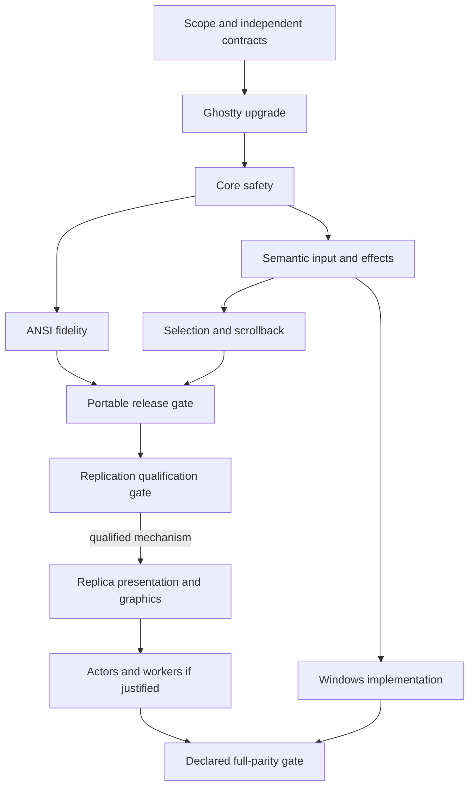

# Finalized `libghostty-vt` parity plan

## Case-study scope

Pinned evidence:

- **Herdr:** `d76657f2c7fc18dcce3b9af43842c8afaba1646b`
- **Herdr’s vendored Ghostty:** `c5a21edfcbc2d5b46540ad91b7980aca31f5f1f3` ([metadata](https://github.com/herdrdev/herdr/blob/d76657f2c7fc18dcce3b9af43842c8afaba1646b/vendor/libghostty-vt.vendor.json))
- **Lemma:** `2039b9a53458278548033552b589824e0dcad690`
- **Target Ghostty qualification:** `226a91658da6400140a7da3f38b825ba0395bd5d`

Herdr is a **case study and regression source**. Ghostty is the semantic contract.

## North-star definition

Lemma—not `libghostty-vt`—owns product scope. Every capability exposed by the pinned Ghostty revision must be reviewed in `docs/ghostty-feature-parity.md` and classified as one of:

- **REQUIRED** — baseline behavior and a release blocker;
- **SUPPORTED** — implemented and covered, but not part of the minimum profile;
- **BACKEND_SPECIFIC** — available only through named presentation backends;
- **PERMISSION_GATED** — implemented but subject to explicit policy or consent;
- **INTENTIONALLY_UNSUPPORTED** — not advertised or accepted, with a documented reason.

Backend and permission qualifiers may accompany a required or supported capability. A newly exposed Ghostty feature does not automatically become a Lemma commitment.

For every advertised or accepted child-visible capability or side effect, Lemma must:

1. preserve canonical terminal state in Ghostty;
2. use Ghostty’s semantic encoder/API where available;
3. route side effects through an explicit policy;
4. realize the behavior through every presentation backend that claims it;
5. declare backend-specific degradation or rejection explicitly;
6. bound memory, transport, and untrusted data;
7. maintain a regression test.

No advertised or accepted child-visible capability or side effect may be silently discarded. Parsing unknown or intentionally unsupported terminal sequences as protocol-defined no-ops remains valid.

## Independent architectural axes

Three contracts remain independent:

1. **`ChildTerminalProfile`** — what the child is told the terminal supports: `TERM`, device attributes, graphics, colors, keyboard guarantees, and query responses.
2. **`HostCaptureProfile`** — the richest safe semantic information the physical terminal should report to the thin client.
3. **`PresentationBackend`** — how the client displays canonical terminal state: ANSI projection or a compatible Ghostty replica.

Changing presentation backend must not inherently change the child terminal profile. Inner child modes control Ghostty’s encoding to the PTY; they do not directly control how the outer terminal captures input.

---

# Resolution of the 12 planning issues

## 1. Separate child capabilities from presentation

### Herdr lesson

Herdr uses an explicitly versioned handshake, negotiates `SemanticFrame` versus `TerminalAnsi`, carries pixel geometry, and sends client-control messages for mouse and keyboard modes. [Herdr protocol](https://github.com/herdrdev/herdr/blob/d76657f2c7fc18dcce3b9af43842c8afaba1646b/src/protocol/wire.rs)

### Final decision

Model child capabilities and presentation independently:

```cpp
enum class ChildTerminalProfile {
    portable_v1,
    ghostty_extended_v1,
};

enum class PresentationBackend {
    ansi,
    ghostty_replica,
};
```

`ChildTerminalProfile` is immutable for the life of a session:

- `TERM`, device attributes, terminfo name, graphics availability, query responses, color semantics, and input guarantees derive from it;
- detaching or attaching a different client does not change it;
- `portable_v1` advertises only the stable portable contract;
- `ghostty_extended_v1` may advertise additional child-facing Ghostty semantics such as Kitty graphics, but never transport details such as snapshots or RenderState.

`PresentationBackend` is negotiated independently for each attachment:

- `ansi` projects canonical state to a physical terminal;
- `ghostty_replica` uses a qualified replication protocol and compatible Ghostty build;
- moving between these backends does not change the running child’s profile;
- a profile/backend combination not covered by the parity matrix must be rejected or presented only after explicit user acknowledgement of the named limitation.

The M0 matrix must cover the cross-product of child profile and presentation backend. Snapshot transport, native rendering, and exact replica compatibility belong to `PresentationBackend`, not `ChildTerminalProfile`.

Deliverable: `docs/ghostty-feature-parity.md`.

---

## 2. Color and theme model

### Herdr lesson

Herdr queries outer foreground, background, and all 256 palette entries, then compares active Ghostty colors against defaults so only overridden palette entries require RGB projection. [Theme model](https://github.com/herdrdev/herdr/blob/d76657f2c7fc18dcce3b9af43842c8afaba1646b/src/terminal_theme.rs), [render translation](https://github.com/herdrdev/herdr/blob/d76657f2c7fc18dcce3b9af43842c8afaba1646b/src/pane/terminal.rs)

Current Ghostty now directly separates embedder defaults from child OSC overrides for foreground, background, cursor, and the palette. [Ghostty terminal colors](https://github.com/ghostty-org/ghostty/blob/226a91658da6400140a7da3f38b825ba0395bd5d/include/ghostty/vt/terminal.h)

### Final decision

1. Capture or configure a concrete **session theme** at session creation:
   - foreground,
   - background,
   - cursor,
   - 256-color palette.

2. Apply it through Ghostty terminal color options.

3. Store it as immutable session metadata. An explicit user command may update it; ordinary reattachment may not.

4. Each attaching ANSI client reports its host colors.

5. ANSI projection rules:
   - use `Reset` only when the host default matches the session default;
   - use indexed color only when the host palette entry matches the session entry;
   - otherwise emit RGB;
   - child OSC overrides always use Ghostty’s effective value;
   - background-only cells use Ghostty’s resolved background API;
   - never forward per-pane OSC 4/10/11 globally.

6. Cursor color:
   - query and retain the host cursor color;
   - apply the focused pane’s effective cursor color;
   - restore host color on pane switch/detach.

This preserves a stable authoritative theme while retaining efficient host defaults when they match.

---

## 3. Typed input without pretending legacy TTY bytes are richer than they are

### Herdr lesson

Herdr maintains a stateful framer with explicit key, text, paste, mouse, focus, host-query, and unsupported outcomes. It also retains raw-source metadata and supports structured events for richer clients. [Herdr raw input](https://github.com/herdrdev/herdr/blob/d76657f2c7fc18dcce3b9af43842c8afaba1646b/src/raw_input.rs), [wire events](https://github.com/herdrdev/herdr/blob/d76657f2c7fc18dcce3b9af43842c8afaba1646b/src/protocol/wire.rs)

The Kitty protocol confirms that repeat/release, alternate keys, and associated text exist only when negotiated; legacy input cannot recover them. [Kitty keyboard specification](https://sw.kovidgoyal.net/kitty/keyboard-protocol/)

### Final decision

Protocol event types:

```text
Key
TextCommit
Paste
Mouse
Focus
RawBytes
```

`Key` fields are optional where the host cannot provide them:

```text
action
semantic key
modifiers
consumed modifiers
base/unshifted codepoint
generated text
repeat count
source: LegacyVT | Kitty | Native
```

Rules:

- The attached client owns a stateful host-input decoder.
- At attachment, negotiate the richest safe `HostCaptureProfile` the physical terminal and client can reliably support.
- Outer bracketed paste, focus reporting, and negotiated Kitty keyboard capture remain stable for the attachment; they do not mirror the focused child’s corresponding modes.
- Preserve unknown sequences as `RawBytes`.
- Never reinterpret `RawBytes` inside paste.
- Prefix handling runs only on decoded key events.
- Paste is always a separate opaque event.
- Server routes:
  - key → Ghostty key encoder,
  - paste → Ghostty paste API,
  - mouse → Ghostty mouse encoder,
  - focus → Ghostty focus encoder.
- Ghostty’s current inner terminal modes determine whether and how each semantic event is encoded to the PTY.
- Do not fabricate release, physical-key, or composing information.

Ghostty’s paste API provides control stripping, bracketed wrapping, newline handling, and injection checks. [Ghostty paste API](https://github.com/ghostty-org/ghostty/blob/226a91658da6400140a7da3f38b825ba0395bd5d/include/ghostty/vt/paste.h)

---

## 4. Synchronized output must be per pane

### Herdr lesson

Herdr queries Ghostty mode 2026 after every PTY mutation and suppresses render requests while it remains active. [Herdr synchronization](https://github.com/herdrdev/herdr/blob/d76657f2c7fc18dcce3b9af43842c8afaba1646b/src/pane/terminal.rs)

Herdr does not provide the complete Lemma solution: no explicit integration-level watchdog was found.

### Final decision

Each pane receives:

```text
PresentationGate
├── child_synchronized_output: bool
├── suppression: inactive | held | watchdog_released
├── pending_output
└── deadline
```

`child_synchronized_output` is canonical Ghostty state. `suppression` is Lemma presentation policy; neither may impersonate the other.

While held:

- Ghostty continues parsing;
- PTY replies and effects continue;
- pane rendering emits nothing;
- the pane’s ANSI physical shadow is not advanced;
- dirty rows are not cleared;
- other panes and status UI may still render;
- the pane cursor remains hidden.

When the child genuinely leaves mode 2026:

- clear the gate and schedule one urgent pane render.

On presentation timeout:

- use a named policy constant, initially `synchronized_output_presentation_timeout = 1s`, with a regression test and release justification;
- set `suppression = watchdog_released` without changing Ghostty state;
- force one full presentation and continue presenting for liveness while the child’s canonical mode remains active;
- clear the forced condition only when the child genuinely leaves mode 2026;
- record a diagnostic counter.

If the pinned Ghostty API later defines canonical timeout semantics, Lemma may defer to those semantics rather than inventing another terminal-state transition.

`write_and_report_damage()` should return:

```text
clean
visible_damage
presentation_deferred
```

Tests must cover:

- another pane rendering during the hold;
- watchdog release while Ghostty mode 2026 remains active;
- genuine mode close after watchdog release;
- resize;
- process exit;
- blocked client;
- cursor suppression;
- dirty-state preservation.

---

## 5. Host capture contract and inner input encoding

### Herdr lesson

Herdr hit-tests panes, subtracts pane origins, scales pixel reports, routes wheels according to canonical modes, and tells remote clients when host mouse capture is required. [Mouse routing](https://github.com/herdrdev/herdr/blob/d76657f2c7fc18dcce3b9af43842c8afaba1646b/src/app/input/mouse.rs), [protocol control](https://github.com/herdrdev/herdr/blob/d76657f2c7fc18dcce3b9af43842c8afaba1646b/src/protocol/wire.rs)

It also explicitly clears all known host mouse modes and manages the Kitty keyboard stack. [Mode restoration](https://github.com/herdrdev/herdr/blob/d76657f2c7fc18dcce3b9af43842c8afaba1646b/src/terminal_modes.rs)

### Final decision

Negotiate a physical-terminal capture contract rather than mirroring inner modes:

```text
HostCaptureProfile {
    epoch,
    keyboard_capture,
    bracketed_paste_capture,
    focus_capture,
    mouse_capture,
    mouse_coordinate_precision,
    host_geometry
}
```

Stable attachment-wide capture:

- enable outer bracketed paste so paste remains distinguishable from typing even when the inner child has bracketed paste disabled;
- negotiate the richest reliable Kitty keyboard information once, retaining legacy fallback where unavailable;
- enable outer focus reporting when supported;
- choose outer encodings according to what Lemma can decode, not according to the inner child’s requested encoding.

Mouse is the dynamic exception because capture affects host selection and mux UI. Enable or update it only when Lemma UI policy or the focused child requires mouse events, but still request the richest reliable outer coordinate format. Inner Ghostty tracking mode decides whether a normalized mouse event becomes PTY bytes.

Client:

- applies each capture profile atomically;
- ACKs the epoch;
- restores all negotiated physical-terminal modes on normal exit, signal exit, protocol error, or disconnect.

Mouse events carry:

```text
kind
button
modifiers
cell position
optional pixel position
read-time host geometry
capture-profile epoch
```

Server:

1. validates geometry and epoch;
2. hit-tests status, borders, overlays, and panes;
3. consumes mux UI events;
4. translates to pane-local coordinates;
5. configures Ghostty’s mouse encoder from canonical inner terminal state;
6. supplies pane pixel geometry separately;
7. writes encoded bytes only if Ghostty produces output.

The same outer-semantic → inner-Ghostty-encoder rule applies to key, paste, and focus events. Ghostty explicitly separates terminal-derived mouse mode/format from renderer geometry. [Ghostty mouse encoder](https://github.com/ghostty-org/ghostty/blob/226a91658da6400140a7da3f38b825ba0395bd5d/include/ghostty/vt/mouse/encoder.h)

---

## 6. Declared geometry and frame bounds

### Herdr lesson

Herdr separates ordinary frames from large graphics frames and validates expanded input sizes rather than only serialized message counts. [Protocol bounds](https://github.com/herdrdev/herdr/blob/d76657f2c7fc18dcce3b9af43842c8afaba1646b/src/protocol/wire.rs), [transport validation](https://github.com/herdrdev/herdr/blob/d76657f2c7fc18dcce3b9af43842c8afaba1646b/src/server/client_transport.rs)

### Final decision

The current 4 MiB value becomes a **chunk limit**, not a complete-frame promise.

Protocol v2 adds:

```text
FrameBegin { generation }
FrameChunk { generation, bytes }
FrameEnd   { generation }
FrameAbort { generation }
```

A transport transaction and a Ghostty RenderState snapshot have separate lifetimes. Slow presentation must never block PTY ingestion or canonical terminal mutation.

Properties:

- chunks end on row/presentation-operation boundaries;
- one transaction per client;
- at most one RenderState snapshot per active encoder;
- a snapshot may be retained only while encoding, never while waiting for socket writability;
- encoded chunks own their queued bytes independently of the snapshot;
- each encoder has a hard byte budget, snapshot-hold time budget, and forward-progress deadline;
- if the next chunk cannot enter the bounded output queue, or any budget expires, abort immediately and release the snapshot;
- an aborted transaction invalidates the client physical shadow and schedules a later full repair while the canonical terminal keeps advancing;
- ordinary frames remain one chunk;
- outer synchronized output opens at transaction begin and closes at end;
- the client has a local abort watchdog that always closes outer mode 2026.

M0 assigns and tests:

```text
frame_transaction_bytes_max = 64 MiB
render_snapshot_hold_max = 50 ms
frame_transaction_progress_deadline = 5 s without progress
```

The transaction also has an 8 MiB per-attachment queued-byte limit and a 30 s total deadline.
At the declared 500×200 attached geometry, the conservative ANSI bound is 35,204,096 bytes, so it
fits the transaction ceiling while remaining chunked.

The declared geometry contract must fit these budgets under the documented per-cell/grapheme limits; otherwise the resize is rejected before reaching the PTY or a separately specified progressive-repair path is used. Graphics uses a separately negotiated bounded channel.

Initial transport limits:

| Item | Limit |
|---|---:|
| Ordinary frame chunk | 4 MiB |
| Complete frame transaction | 64 MiB |
| Per-attachment queued frame bytes | 8 MiB |
| RenderState hold | 50 ms |
| Transaction progress | 5 s without progress; 30 s total |
| Structured input payload | 1 MiB |
| Structured event batch | 4,096 expanded events |
| Pixel mouse report | 128 B |
| Paste payload | 1 MiB |
| PTY response queue | existing 64 KiB |

Resize is transactional:

1. validate geometry and retain the old size;
2. reserve all new Lemma presentation state;
3. resize Ghostty;
4. resize the PTY;
5. if the PTY resize fails, roll Ghostty back to the old size;
6. terminate the pane visibly only if rollback fails and consistency cannot be restored.

The invariant is that PTY geometry and canonical Ghostty geometry never remain disagreed. The 1,000×1,000 value remains an abuse hard-limit, not a promise that every worst-case frame fits one buffer.

---

## 7. Ghostty upgrade policy

### Herdr lesson

Herdr stores exact source/archive metadata, rejects dirty vendor sources, verifies required files, and maintains a patch ledger with reasons, removal conditions, and regression tests. [Vendor contract](https://github.com/herdrdev/herdr/blob/d76657f2c7fc18dcce3b9af43842c8afaba1646b/scripts/test_vendor_libghostty_vt.py), [patch ledger](https://github.com/herdrdev/herdr/blob/d76657f2c7fc18dcce3b9af43842c8afaba1646b/vendor/libghostty-vt.patches.md)

### Final decision

Add beside the Ghostty gitlink so the superproject can version the files:

```text
third_party/ghostty-metadata/PIN.json
third_party/ghostty-metadata/PATCHES.md
```

(The originally proposed paths inside `third_party/ghostty` cannot be tracked by the superproject
while that directory is a Git submodule.)

`PIN.json` records:

- exact Ghostty commit;
- Zig version;
- build options;
- expected build features;
- optimization mode.

Policy:

- one production pin;
- no requirement for product source compatibility with two Ghostty versions;
- scheduled canary qualification against upstream;
- every upgrade includes:
  - public-header diff;
  - result/mode/effect review;
  - feature-matrix update;
  - unit/E2E/differential tests;
  - allocation/memory census;
  - performance comparison.

The upgrade branch must not block independent P0 safety fixes against the current production pin.

Any local Ghostty patch requires:

- upstream issue/PR;
- exact reason;
- removal condition;
- dedicated test.

---

## 8. Bounded Herdr archaeology

### Final decision

Pin the case study to Herdr `d76657f...`; do not continuously chase Herdr `master`.

Create `docs/herdr-case-study.md` containing at most the top 20 relevant cases:

```text
symptom
protocol/API involved
Herdr source/issue
does current Ghostty already fix it?
Lemma applicability
regression test or not-applicable reason
```

Initial families:

- fragmented host replies;
- ESC/mouse ambiguity;
- oversized paste;
- keyboard restoration;
- Kitty metadata;
- default colors;
- cursor shape;
- pixel mouse;
- graphics partial updates;
- resize/reflow;
- Unicode/grapheme reset;
- scrollback behavior.

Completion condition:

- every selected case is either represented by a Lemma test or marked not applicable;
- repeat only during Ghostty upgrades or relevant incidents.

Behavior may be ported. Herdr’s architecture is not.

---

## 9. Selection and copy mode

### Herdr lesson

Herdr’s current selection layer retains its own absolute row/column endpoints and gesture phases. That is useful evidence of the maintenance burden, not a design to copy. [Herdr selection state](https://github.com/herdrdev/herdr/blob/d76657f2c7fc18dcce3b9af43842c8afaba1646b/src/selection.rs)

Current Ghostty now provides gesture state, word/line/output selection, tracked-reference guidance, endpoint adjustment, and bounded formatting. [Ghostty selection API](https://github.com/ghostty-org/ghostty/blob/226a91658da6400140a7da3f38b825ba0395bd5d/include/ghostty/vt/selection.h)

### Final decision

Ghostty owns:

- gesture interpretation;
- selection endpoints;
- word/line/output semantics;
- selection ordering;
- endpoint motion;
- tracked anchors across mutation;
- formatting selected content.

Lemma owns:

- entering/exiting copy mode;
- active pane;
- bindings;
- viewport policy;
- UI overlays;
- search query/result index;
- clipboard authorization.

Search may read Ghostty-provided terminal text transiently, but must not build a persistent duplicate terminal grid.

Current single-client sessions use one session selection. Future multi-client replica-backed sessions use per-client tracked endpoints rather than sharing Ghostty’s installed active selection.

---

## 10. Security policy

### Herdr lesson

Herdr:

- sanitizes child-controlled titles before emitting OSC;
- validates expanded input and repeat counts;
- separates large graphics limits;
- validates pixel geometry and graphics responses.

[Effect sanitization](https://github.com/herdrdev/herdr/blob/d76657f2c7fc18dcce3b9af43842c8afaba1646b/src/terminal_effects.rs), [input validation](https://github.com/herdrdev/herdr/blob/d76657f2c7fc18dcce3b9af43842c8afaba1646b/src/server/client_transport.rs)

### Final decision

| Effect/data | Policy |
|---|---|
| PTY reply overflow | terminal integrity failure; terminate pane visibly |
| Bell | typed client event; client preference decides sound/visual |
| Title/PWD/progress/notification | 4 KiB max, strip C0/ESC/ST, rate-limit |
| OSC 52 clipboard | default deny/prompt; 1 MiB decoded maximum |
| Hyperlink URI | 8 KiB maximum, strip control terminators |
| Unknown sequence | log identifier/hash only; token-bucket rate limit |
| Paste | 1 MiB, opaque event, Ghostty encoding |
| Graphics | explicit byte/pixel/placement/aggregate limits |
| Snapshot | exact-version check, CRC validation, decoder continuation limit |
| Client input | serialized size plus expanded-event accounting |

Ghostty callbacks remain synchronous and nonblocking: copy into bounded adapter queues, then apply policy in core.

---

## 11. Test strategy

### Final decision: five layers

1. **Ghostty adapter contracts**
   - construction/options;
   - mode queries;
   - effects;
   - RenderState dirty lifetime;
   - selection;
   - snapshots;
   - build feature assertions.

2. **Differential projection**
   - authoritative Ghostty → Lemma ANSI → second Ghostty;
   - compare cells, effective colors, cursor, modes, and links.

3. **Host-input corpus**
   - legacy;
   - xterm modifiers;
   - modifyOtherKeys;
   - Kitty press/repeat/release;
   - alternate keys;
   - generated text;
   - keypad;
   - every fragmentation boundary.

   Herdr maintains exactly this form of executable corpus. [Herdr keyboard corpus](https://github.com/herdrdev/herdr/blob/d76657f2c7fc18dcce3b9af43842c8afaba1646b/tests/fixtures/keyboard_protocol_corpus.tsv)

4. **Real-host smoke matrix**
   - Ghostty;
   - Terminal.app;
   - iTerm2;
   - Kitty;
   - WezTerm;
   - xterm;
   - nested tmux where supported.

5. **PTY/E2E**
   - editors, pagers, shells;
   - vttest-style sequences;
   - blocked client;
   - detach/reattach;
   - crash restoration;
   - oversized and malicious inputs.

Release gates:

- all matrix rows link to tests;
- no unexplained benchmark regression over 10%;
- warmed render path remains allocation-free;
- input-to-PTY p99 and frame-queue p99 stay within recorded budgets;
- no accepted input or geometry can cause silent truncation or corruption.

---

## 12. Parallel ownership without destroying the clean boundary

### Final decision

After the Ghostty upgrade, mechanically split the private implementation while preserving the public `lemma::vt::Terminal` facade:

```text
src/terminal/terminal_impl.hpp       # private Ghostty handles
src/terminal/terminal_core.cpp
src/terminal/terminal_render.cpp
src/terminal/terminal_input.cpp
src/terminal/terminal_effects.cpp
src/terminal/terminal_selection.cpp
```

Ghostty headers and handles still remain inside the terminal target.

Work ownership:

| Track | Primary files |
|---|---|
| Dependency/core | CMake, pin metadata, `terminal_core.cpp` |
| Projection | `terminal_render.cpp`, compositor |
| Input/protocol | client, protocol, `terminal_input.cpp` |
| Effects/security | `terminal_effects.cpp`, engine |
| Selection/scrollback | `terminal_selection.cpp`, copy-mode core |
| Tests/research | fixtures, differential harness, CI |

Public-header and protocol changes merge through one owner.

---

# Final milestone plan



## M0 — Contract and reproducibility

- classified Ghostty capability matrix;
- independent `ChildTerminalProfile` and `PresentationBackend` matrix;
- `HostCaptureProfile` policy;
- session theme policy;
- numerical security, render-snapshot, queue, and progress limits;
- Herdr top-20 case study;
- build-output isolation;
- Ghostty pin metadata;
- failing characterization/regression tests.

## M1 — Current Ghostty and private adapter split

- upgrade to `226a916...`;
- Zig 0.16 pin;
- current constructor/mode/result changes;
- build-info tests;
- mechanical private-source split;
- all existing and milestone regression tests pass.

## M2 — Core safety

Parallel vertical slices:

- background-only colors and palette;
- per-pane synchronized output;
- opaque paste;
- effects and response overflow;
- frame transactions;
- transactional resize with rollback and fail-closed last recovery;
- temporary graphics disablement.

**Exit gate:** no silent corruption, freeze, false capability, or accepted-size detachment.

## M3 — Semantic input and effects

Order:

1. protocol version and event schema;
2. host input decoder;
3. typed paste/text;
4. keyboard events and raw fallback;
5. host capture negotiation/ACK/restoration;
6. mouse hit-testing and encoder;
7. focus routing;
8. complete Ghostty effect policy.

Client and server implementations may proceed in parallel after the schema freezes.

## M4 — Selection and scrollback

- Ghostty selection gestures;
- tracked refs;
- copy mode;
- viewport navigation;
- bounded formatting;
- search without retained duplicate grid;
- separate byte/line limits;
- idle compression.

## M5 — Portable ANSI release gate

Every capability advertised by `portable_v1` for the `ansi` presentation backend must be:

- fully preserved;
- explicitly permission-gated;
- or classified with a named, user-visible backend limitation.

Every intentionally unsupported capability must remain unadvertised and have a documented rationale. Complete the real-host smoke matrix and mode-restoration testing.

## M6 — Replication qualification: GO/NO-GO

Snapshot replication is a candidate mechanism, not yet committed architecture. Build a bounded prototype for:

```text
snapshot at generation N
+ ordered VtWrite/Resize/TerminalSet events after N
+ ACK/resync
```

The qualification must prove that snapshot plus ordered replay converges to the authoritative terminal across:

- every relevant parser split and unfinished parser continuation;
- resize ordering and resize/write races;
- primary, alternate, and incremental history restoration;
- synchronized output state;
- graphics image and placement state;
- bounded memory, replay, and reconnect behavior;
- missing, duplicated, and reordered mutation detection;
- effect suppression so replicas never answer the PTY, ring bells, or repeat clipboard/notification effects;
- disconnect and resynchronization after replay gaps;
- malformed snapshot and version-mismatch rejection.

The prototype also requires:

- exact Ghostty build identity;
- mutation sequence numbers;
- a bounded replay ring;
- snapshot-after-gap recovery;
- no cross-version snapshot assumption;
- ANSI fallback throughout qualification.

**GO:** all invariants pass under deterministic, fuzz, resource-bound, and end-to-end tests. M7 may use Ghostty snapshot replication.

**NO-GO:** keep ANSI production behavior and qualify a bounded semantic-render replication protocol instead. Native rendering remains a product goal, but M7 cannot start until one replication mechanism passes the same invariants.

Current snapshot v1 supports renderable READY state and incremental history but has no compatibility guarantee. [Ghostty snapshots](https://github.com/ghostty-org/ghostty/blob/226a91658da6400140a7da3f38b825ba0395bd5d/include/ghostty/vt/snapshot.h)

## M7 — Replica presentation and Kitty graphics

Entry gate: M6 has qualified either Ghostty snapshot replay or the bounded semantic-render alternative.

- presentation replica per pane;
- client-side RenderState;
- native compositor;
- cursor/link/selection overlays;
- image data and placement lifecycle;
- clipping, scrolling, resizing, animation;
- image namespace isolation;
- bounded chunking and storage;
- protocol response routing.

The Kitty protocol requires explicit chunking, geometry, lifecycle, and untrusted file/SHM handling—not raw APC forwarding. [Kitty graphics specification](https://sw.kovidgoyal.net/kitty/graphics-protocol/)

## M8 — Terminal actors and render workers

After profiling:

- shard-owned terminal actors;
- one Ghostty owner;
- no general terminal mutex;
- two-phase RenderState capture;
- one in-flight snapshot per pane;
- bounded SPSC queues;
- generation-controlled frame cancellation.

Ghostty’s two-phase RenderState API is explicitly designed for this division. [RenderState contract](https://github.com/ghostty-org/ghostty/blob/226a91658da6400140a7da3f38b825ba0395bd5d/include/ghostty/vt/render.h)

## M9 — Broad Windows support

After semantic IPC stabilizes:

- ConPTY;
- native console key records;
- repeat/release and physical identity;
- IME/text commits;
- resize/pixel geometry;
- process/job lifecycle;
- mode restoration;
- Windows Terminal compatibility.

---

# Parallel and sequential summary

## Parallel after M1

- ANSI fidelity;
- input client;
- input server;
- effects/security;
- selection API adapter;
- scrollback compression;
- replication qualification prototype;
- Windows feasibility;
- Herdr-derived tests.

## Strict dependencies

1. Capability classification plus `ChildTerminalProfile` → child spawn/advertisement.
2. `PresentationBackend` negotiation remains independent of the running child profile.
3. Ghostty upgrade → current selection/snapshot APIs.
4. Event schema plus `HostCaptureProfile` → client/server input implementation.
5. Host capture restoration → removal of raw mouse/focus/paste mirroring.
6. Core safety → portable ANSI release.
7. Replication qualification GO—snapshot or alternative → replica presentation.
8. Qualified replica presentation → complete graphics parity.
9. Profiling evidence → actors/workers.
10. Stable semantic protocol → broad Windows implementation.

## Merge order

1. Build isolation and pin metadata
2. Ghostty upgrade
3. Private adapter split
4. Capability classification and independent child/presentation contracts
5. Session theme model
6. Background/color/cursor fidelity
7. Per-pane synchronized output
8. Paste/effect/overflow safety
9. Bounded frame transactions and resize rollback
10. Semantic input and host capture protocol
11. Mouse/focus routing
12. Selection/scrollback
13. Portable ANSI release gate
14. Replication GO/NO-GO qualification
15. Qualified replica presentation and graphics
16. Actors/workers if profiling justifies them
17. Windows parity

This is the finalized roadmap: **portable ANSI correctness first; replica presentation remains a committed product goal, while Ghostty snapshots are a GO/NO-GO implementation choice rather than a preselected architectural dependency. Child capability, physical-host capture, and client presentation remain independent contracts throughout.**
